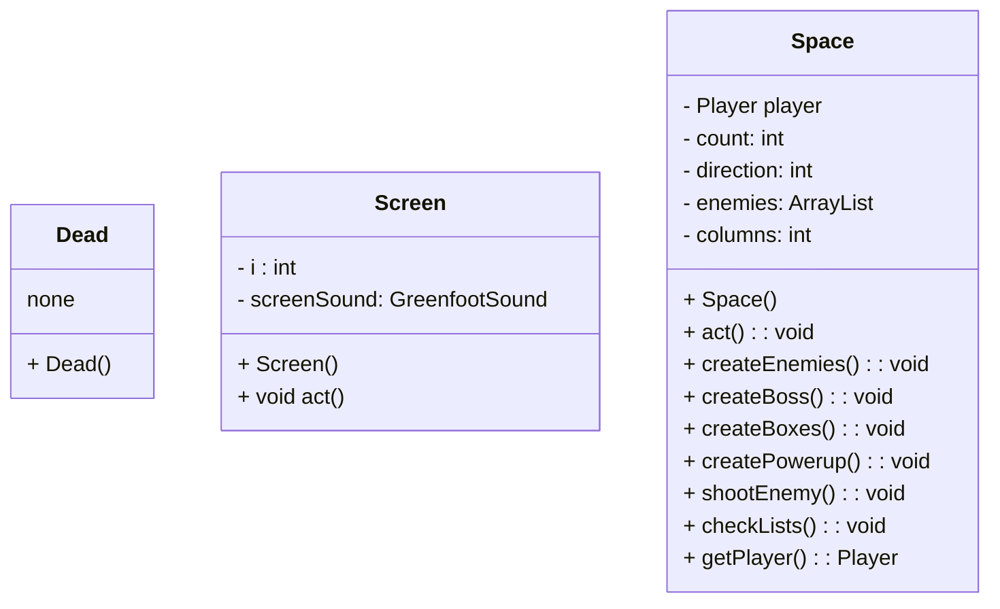
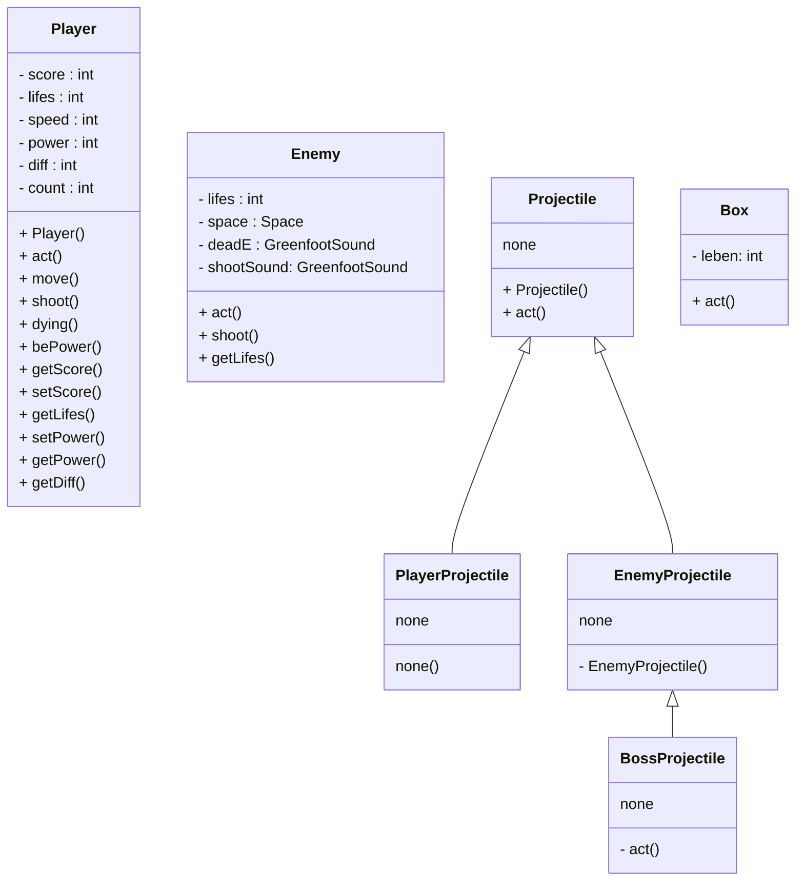

# Space Invaders

[TOC]

## Einleitung

Das auf den folgenden Seiten beschriebene Programm, ist eine Greenfoot-Adaption des klassischen Spiels "Space Invaders" (1978) für Atari 2600. Das Ziel dieses Spiels ist es, alle Aliens zu zerstören bevor diese den Spieler erreichen können.

Unsere Adaption verfügt dabei zusätzliche Funktionen, die wir als Erweiterung für das klassische Spiel hinzugefügt haben. 

---

## Basis 

Wie fast jedes Greenfoot-Projekt besitzt auch "Space Invaders" die Oberklassen World und Actor, dessen Funktion in der Greenfoot-eigenen Dokumentation beschrieben ist. 

Für eine Basis-Version des Spiels werden die folgenden Klassen benötigt:

### Unterklasse(n) World:

#### Diagramm



#### Funktion

Die Weltmethoden sind allgemein zur Strukturierung des Ablaufs da. So sind die Klassen Screen und Dead für dekorative Zwecke da, während Space die vollständige Funktionalität übernimmt. 

##### Ablauf

Nach dem die Leertaste betätigt wurde, wird eine neue Welt (Klasse Space) erzeugt und es werden Instanzen der Klassen Player, Enemy und Box in die Welt gesetzt. 
Dabei werden die Gegner beim erstellen in eine LinkedList eingefügt, sodass jede Gegnerspalte als Liste dargestellt wird. 

```java
//Space.java, line 40
private void createEnemies()
    {
        for (int i = 0; i < 11; i++) {
            LinkedList<Enemy> ll = new LinkedList<Enemy>();
            for(int j = 0; j < 5; j++) {
                Enemy enemy = new Enemy();
                addObject(enemy, 550 - i * 50, 290 - j * 60);
                ll.add(enemy);
            }
            enemies.add(ll);
        }
    }
```

Nun wird die act()-Methode ausgeführt. Diese übernimmt die Anzeige der Statistiken, die Bewegung und das Schießen der Gegner. Zusätzlich werden hier  die Powerups zufällig erzeugt und der Boss in die Welt gesetzt, was im Laufe der Dokumentation erläutert wird.

Interessant ist hier die Art, wie die Gegner schießen. Dadurch, dass die Gegner im Konstruktor in Listen sortiert wurden, ist es leichter den "Ersten" zu finden, da dieser nun als erster in der LinkedList ll erscheint. Die Spalten-Listen sind auch als Liste gespeichert (große Liste -> enemies : ArrayList). 
Dabei wird erst mit checkLists() geprüft, ob die Listen gefüllt sind. Sollte eine LinkedList leer ausfallen, wird diese aus dem großen Array gelöscht. Danach wird  mit shootEnemy() eine zufällige Liste ausgesucht, die dann das erste Enemy Objekt zum schießen bringt. Zuletzt wird überprüft, ob ein Gegner keine Leben mehr hat und aus der Welt und den Listen entfernt werden kann. 

```java
//Space.java, line 101
private void checkLists() {
        for (Iterator<LinkedList> iterator = enemies.iterator(); iterator.hasNext();) {
            LinkedList ll = iterator.next();
            if (ll.size() <= 0) {
                iterator.remove();
                columns--;
            }
        }
    }
    
    private void shootEnemy(){
        try{
           LinkedList<Enemy> currentColumn = enemies.get(Greenfoot.getRandomNumber(columns));
           currentColumn.getFirst().shoot();
        } catch(Exception e){}
    }
    
    private void checkEnemies() {
        for (LinkedList ll: enemies) {
            try {
                for (Object e: ll) {
                    if (((Enemy)e).getLives() <= 0) {
                        removeObject((Actor)e); 
                        try {
                            ll.remove(ll.indexOf(e));
                        } catch(Exception ex) {}
                    }
                }
            } catch(Exception e) {}
        }
    }
```


### Unterklasse(n) Actor

#### Diagramm



#### Funktion

##### Player

Die Player Klasse ist die größte aller Klassen, da diese neben Elementen der Bedienung auch einige Elemente der allgemeinen Spielsteuerung beinhaltet. 

Die Parameter  die das Verhalten des Spielers betreffen sind lifes, speed, und power. Die restlichen Parameter gehören zum allgemeinen Spielablauf. 

Die act()-Methode führt move(), shoot(), dying() und bePower() aus. Die move()-Methode bewegt den Spieler in Abhängigkeit von dem was gedrückt wird, shoot() erstellt ein Objekt der Klasse PlayerProjectile, dying() überprüft, ob der Spieler getroffen wurde und bePower() ist wichtig für das Powerup. 

Die restlichen Methoden sind Getter und Setter, die die Parameter weitergeben und verändern.

##### Enemy 

Da der Gegner von der Welt gesteuert wird, besitzt er nur die zwei Methoden shoot() und act(). Die Methode shoot() erzeugt ein Objekt der Klasse EnemyProjectile und act() überprüft, ob der Gegner getroffen wurde. Die Bewegung der Aliens passiert in Space und wird mit Hilfe einer for-Schleife gelöst. 

```java
//Space.java, line 87
private void moveEnemy() {
    for(Enemy e : getObjects(Enemy.class)) {
        if(e.isAtEdge()) {
            direction *= -1;
            for(Enemy f : getObjects(Enemy.class)) {
                f.move(Player.diff* direction);
                f.setLocation(f.getX(), f.getY() + 20);
            }
        }
        e.move(Player.diff* direction);
    }
}
```


##### Projectile 

Die Klasse Projectile hat die Unterklassen PlayerProjectile und EnemyProjectile, wobei EnemyProjectile noch die Unterklasse BossPrjectile besitzt. Damit lässt sich mit der Methode getIntersectingObject() einfach überprüfen, ob man von einem Gegner oder einem Spieler getroffen wurde. Zusätzlich haben die Projektile auch unterschiedliche Farben.

---

## Zusätzliche Features

### Powerups 

Um das Spiel interessanter zu gestalten, haben wir Powerups hinzugefügt. Diese Fallen zufällig vom oberen Bildschirmrand und bewegen sich im Zickzack abwärts. Beim Zerschießen des Powerups wird der Parameter power geändert, wodurch der Spieler ein Vorteil erhält. 

```java
//Player.java, line 77
private void bePower(){
    if(power == 0){
        speed = 1;
    }else if(power == 2){
        getWorld().addObject(new HealthAnimation(true),getX() + 20,getY() - 25);
        lifes++;
        setPower(0);
    } else if (power == 3){
        speed = 2;
    }
}

//Player.java, line 44
private void shoot(){
    if(getWorld().getObjects(PlayerProjectile.class).size() == 0 || power == 1) {
        try {
            if(Greenfoot.isKeyDown("space")) {
                shootSound.play();
                getWorld().addObject(new PlayerProjectile(), getX(), getY() - 45);
            }
        } catch (Exception e) {}
    }
}
```


Es gibt drei verschiedene Items die folgende Auswirkungen auf den Spieler haben:

| Farbe | Beschreibung                                              |
| ----- | --------------------------------------------------------- |
| blau  | erhöht die Schussrate (wird in shoot() geändert)          |
| gelb  | erhöht die Geschwindigkeit des Spielers (Parameter speed) |
| rot   | gibt dem Spieler ein weiteres Leben (Parameter lifes)     |


### Endboss

Wenn alle 50 Gegner vom Spieler abgeschossen wurden, erscheinen ein violettfarbenes Raumschiff und ein Mond. 

Der Endboss hat 3 Leben und bewegt sich auf einer parabelförmigen Bahn. Er greift den Spieler mit unterschiedlichen Mengen an Projektilen an. Mit einer Wahrscheinlichkeit von 25% werden 3 Geschosse abgefeuert und mit einer Wahrscheinlichkeit von 1/16 werden 5 Projektile erzeugt. 

```java
//Boss.java, line 33
void shoot()
    {
            if (getWorld().getObjects(BossProjectile.class).size() == 0) {
                shootSound.play();
                getWorld().addObject(new BossProjectile(), getX(), getY() + 4);
                if (Greenfoot.getRandomNumber(4)== 1){
                    getWorld().addObject(new BossProjectile(), getX() -10, getY() + 4);
                    getWorld().addObject(new BossProjectile(), getX() +10, getY() + 4);
                    
                    if (Greenfoot.getRandomNumber(4)== 1){
                    getWorld().addObject(new BossProjectile(), getX() -20, getY() + 4);
                    getWorld().addObject(new BossProjectile(), getX() +20, getY() + 4);
                   }
                }
        }
    }
```


Außerdem fliegt ein Mond hin und her, dessen Aufgabe es ist dem Spieler das Leben schwer zu machen. Er wirft mit einer Wahrscheinlichkeit von 1/500 pro act()-Methode eine Bombe ab, die dem Spieler bei Berührung ein Leben abzieht. Der Abwurf passiert auch, wenn der Mond vom Spieler getroffen wird. 

```java
//Moon.java, line 16
if(isTouching(PlayerProjectile.class)){
            getWorld().removeObject(getOneIntersectingObject(PlayerProjectile.class));
            getWorld().addObject(new Bomb(), getX(), getY() + 4);
        }
        
        if(Greenfoot.getRandomNumber(500)==1){
            getWorld().addObject(new Bomb(), getX(), getY() + 4);
        
        }
```


## Abschließende Worte

### Ablauf der Arbeit

Grundsätzlich war die Arbeit ziemlich offen und flexibel. Zu Beginn der Arbeit haben wir uns ein Konzept erstellt, welches eine grobe Idee des Spiels darstellen sollte. Im späteren Verlauf hat jedes Gruppenmitglied eine beliebeige Aufgabe gewählt, um das Konzept zu verwirklichen. Trotz Arbeitsteilung wurden dennoch viele Probleme gemeinsam gelöst. Zum Schluss und auch zwischendurch wurden Versionen zusammengeführt, sodass wir nun ein einheitliches Endprodukt haben.
